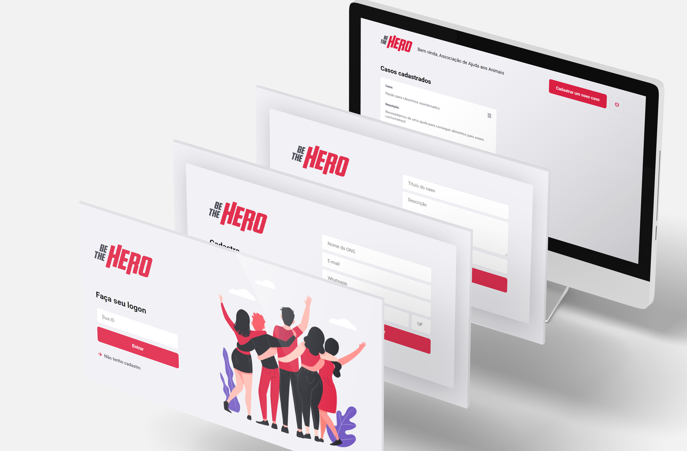
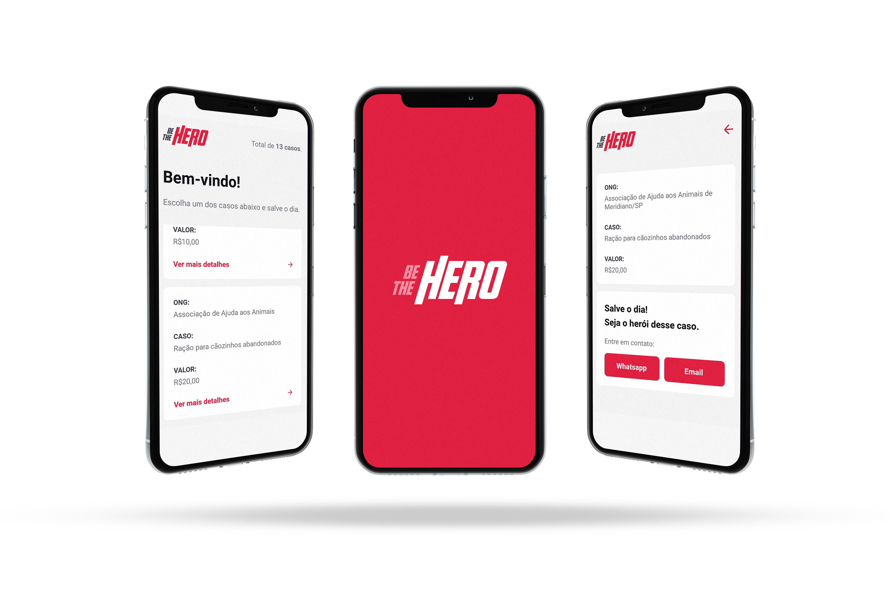

<h1 align="center">
    
</h1>
<h4 align="center"> 
	:heavy_check_mark: 🚀 Semana OmniStack 11.0 :heavy_check_mark:
</h4>

Projeto <strong>Be The Hero</strong> desenvolvido durante a Omnistack da <a href="https://rocketseat.com.br">Rocketseat</a> 🚀👩🏽‍🚀

  
  <a aria-label="Versão do Node" href="https://github.com/nodejs/node/blob/master/doc/changelogs/CHANGELOG_V12.md#12.16.2">
    </img>
  </a>
  <a aria-label="Versão do React" href="https://github.com/facebook/react/blob/master/CHANGELOG.md#16131-november-14-2019">
    </img>
  </a>
  

## 💻 Projeto

O Be The Hero é um projeto que tem como objetivo unir pessoas com o intuito de ajudar ONGs ❤.

<h1 align="center">
    
</h1>
<h1 align="center">
    
</h1>

## :rocket: Tecnologias

Para a construção do seguinte projeto foi utilizada as seguintes tecnologias:

- [Node.js](https://nodejs.org/en/) 
- [React](https://reactjs.org)
- [React Native](https://facebook.github.io/react-native/)
- [Expo](https://expo.io/)
